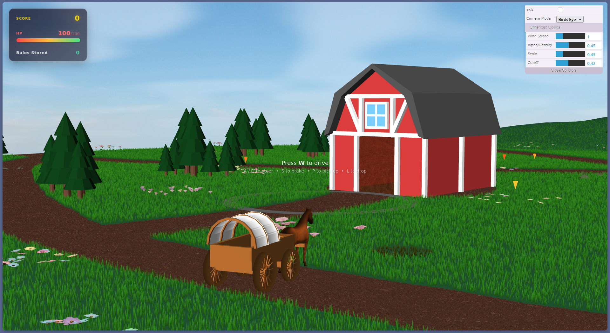
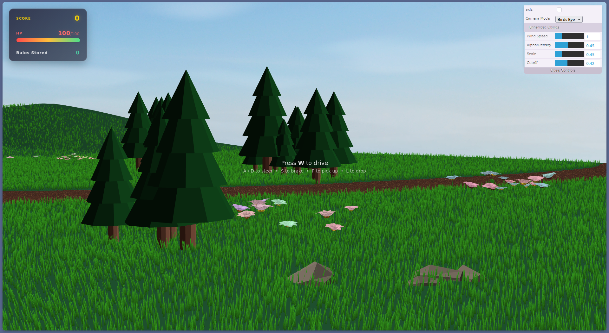
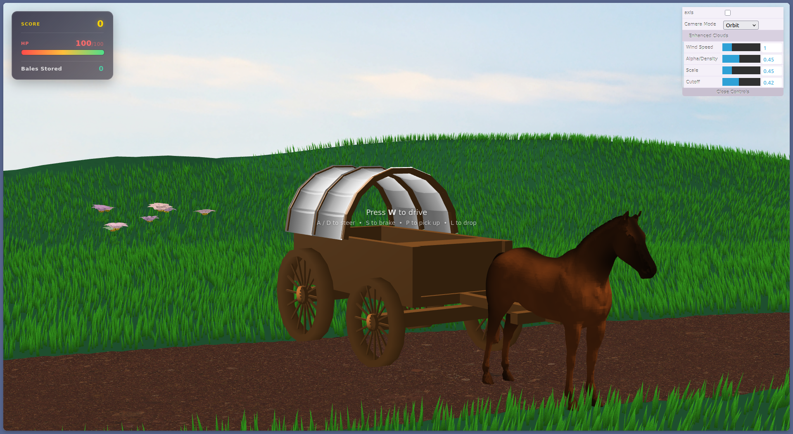
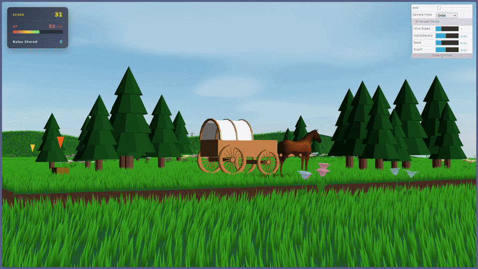

# Farm Wagon Delivery Game

**Course:** Computação Gráfica (CGRA) - L.EIC 2025/2026  
**Group:** T12G05  

### Group Members
- **Maria Inês Pinho** (202306659, up202306659@up.pt)
- **Maria Luiza Vieira** (202304306, up202304306@up.pt)
- **Mariana Almeida** (202405731, up202405731@up.pt)

---

## 1. Project Description
The **Farm Wagon Delivery Game** is a 3D interactive survival simulation built on WebCGF. Players control a horse-drawn covered wagon (prairie schooner) through a vast prairie. 
The objective is to manage the wagon's health (starting at 100 HP, decaying by 1.5 HP/sec), collect hay bales scattered around the map, and deliver them to the barn to restore health. Hitting obstacles like rocks and trees damages the wagon. Your score is the total number of seconds you manage to survive!

### Key Features
- **Procedural Terrain**: A dynamic 200x200 world generated from heightmaps with multi-layered texturing for roads and grass.
- **Physics-based Movement**: Realistic wagon handling including acceleration, braking, and steering.
- **Animated Horse**: Procedural 4-beat walk cycle synchronized with movement speed, featuring realistic leg bending.
- **Interactive Gameplay**: Pick-up and delivery mechanics, game-over states, and a real-time HUD.
- **Dynamic Lighting**: A directional sun system with a sky sphere and moving clouds.

---

## 2. Instructions to Run
1. Ensure you have a WebGL-compatible browser (Chrome, Firefox, or Edge recommended).
2. Serve the project through a local development server (e.g. VS Code Live Server) and open `index.html`. Opening the file directly may not work due to browser security restrictions on local file access.
3. All dependencies are included in the `lib` folder so no installation required.

---

## 3. Keyboard Controls
| Key | Action |
| :--- | :--- |
| **W** | Accelerate / Drive Forward |
| **S** | Brake / Decelerate |
| **A** | Steer Left (pivots the front wheel axis) |
| **D** | Steer Right (pivots the front wheel axis) |
| **P** | Pick up Hay Bale (when adjacent to a bale) |
| **L** | Drop Hay Bale |
| **R** | Restart Game (active after Game Over) |
| **Mouse** | Camera Rotation (when in Orbit Mode) |

---

## 4. Implemented Features 

Below is a clear checklist of all implemented features, organized by the **10 subthemes of the project guidelines PDF**, categorized by difficulty levels (**Mandatory**, **Advanced**, and **Extra/Bonus**), and detailed with their underlying algorithms and mathematical formulations:

---

### 1. Sky, Clouds, and Sun
*   **Mandatory**:
    *   [x] **Sky & Environment**: A sky dome with moving clouds (procedural shader) and a directional sun system that provides consistent lighting across the map.
*   **Advanced**:
    *   [x] **Procedural Moving Clouds**: Animated cloud layer generated procedurally in the sky fragment shader.
        - *Details:* A 2D value noise function generates cloud density from time-offset UV coordinates: $\text{UV}_{\text{cloud}} = (\text{pos.xz} / \text{pos.y}) \cdot \text{scale} + \vec{d}_{\text{wind}} \cdot \text{time}$. Cloud edges are softened with `smoothstep` and faded at the horizon.

---

### 2. Terrain Elevation & Ground Surface
*   **Mandatory**:
    *   [x] **Dynamic Terrain**: A large 200x200 world generated from a heightmap, providing realistic verticality.
        - *Details:* Vertices are dynamically displaced in the terrain vertex shader using height values sampled from a grayscale heightmap image.
*   **Advanced**:
    *   [x] **Path Shading**: A custom terrain shader that blends base grass textures with a farm road path based on a secondary mask map.
        - *Details:* The fragment shader (`terrain.frag`) samples a black-and-white path mask and uses its intensity to linearly interpolate (mix) the base grass texture with a sandy dirt road texture at road coordinates:
          $$\text{Color}_{\text{final}} = \text{Color}_{\text{grass}} \cdot (1.0 - k_{\text{path}}) + \text{Color}_{\text{dirt}} \cdot k_{\text{path}}$$

---

### 3. Scatter Elements (Rocks)
*   **Mandatory**:
    *   [x] **Textured Rocks & Vertex Perturbation**: Rocks generated with multiple textures and vertex perturbation.
        - *Details:* A vertex shader perturbs primitive sphere coordinates along their normal vectors using a sine-cosine noise model to generate natural, bumpy rocks:
          $$P'_{\text{vertex}} = P_{\text{vertex}} + \vec{N}_{\text{vertex}} \cdot A \cdot \sin(\omega \cdot P_{\text{vertex}}.x + \phi)$$
*   **Advanced**:
    *   [x] **Procedural Generation of Items**: Automated, safe spawning of obstacles (rocks and trees) dynamically scattered across the rolling terrain.
        - *Details:* The game controller dynamically calculates non-overlapping random coordinates and samples terrain height Y values, applying safe wagon/barn proximity radius buffers to prevent overlapping.

---

### 4. Flora & Grass
*   **Mandatory**:
    *   [x] **Lush Dense Grass Patches**: Dense green grass fields populated across the rolling terrain.
    *   [x] **Parameter-Based Flower Fields**: Flowers with randomized scales, colors, petal counts ($5$ to $12$), and coordinates.
*   **Advanced**:
    *   [x] **Grass Wind Shader**: A custom vertex shader oscillating grass tips over time to simulate a spring breeze. The oscillation amplitude is proportional to the vertex height ($Y$), ensuring the blade base remains rooted:
        $$\Delta x = A_{\text{wind}} \cdot (Y - Y_{\text{base}})^2 \cdot \sin(\omega_{\text{wind}} \cdot \text{time} + \text{offset}_{\text{world}})$$
    *   [x] **Dry Grass Blending**: Blending of dead/dry grass patches with green grass patches to fit the spring prairie environment.
*   **Extra / Bonus**:
    *   [x] **Static Batching/Baking System**: A highly optimized CPU pre-compilation system that merges thousands of individual grass blades and flowers into single massive VRAM buffers. This reduces the WebGL draw call count to a single digit, maintaining a locked 60 FPS.

---

### 5. Covered Light Wagon / Prairie Schooner
*   **Mandatory**:
    *   [x] **Hierarchical Model**: Covered light wagon (prairie schooner) consisting of a cloth cover occupying half the wagon length, a wooden wagon bed, a front tongue to attach horses, and 4 wheels.
*   **Advanced**:
    *   [x] **Highly Detailed Model**: Detailed grain textures and axles.

---

### 6. Wagon Interaction Mechanics & Physics
*   **Mandatory**:
    *   [x] **Steering System**: Interactive front-wheel steering where the wheel rotation matches the steering angle.
    *   [x] **Pickup System**: Ability to detect, pick up, and carry up to two hay bales. Bales are placed side-by-side in the back of the wagon bed (the open half) with synchronized orientations.
*   **Advanced**:
    *   [x] **Movement Physics**: Realistic wagon handling featuring acceleration, deceleration, and braking with simulated inertia (advanced kinematics physics model):
        $$v_{t+1} = v_t + (a_{\text{engine}} - C_f \cdot v_t - C_b \cdot \text{brake}) \cdot dt$$
*   **Extra / Bonus**:
    *   [x] **Terrain-Dependent Speed**: The wagon moves faster on the road path (factor $1.35$) and slower through grass (factor $0.75$). The effect is smoothly interpolated based on how much of the wagon's footprint is on the path, sampled at three points (centre, front, rear).
    *   [x] **Asymmetric Dual-Zone Collision Detection**: Rather than simple circular proximity checks, the wagon is split into two distinct Oriented Bounding Box (OBB) local zones:
        1.  **Zone 1 (Wagon Bed & Wheels)**: Spans local $X: [-2.5, 2.5]$, $Z: [-1.6, 1.6]$ (width $3.2$).
        2.  **Zone 2 (Front Horses)**: Spans local $X: [2.5, 8.0]$, $Z: [-3.2, 3.2]$ (width $6.4$ - extra wide to protect the side-by-side horses).
    *   [x] **Coordinate Rotation Math**:
        Obstacle coordinates $(cx, cz)$ are rotated into the wagon's local space to find the closest points:
        $$lx = (cx - x_{\text{wagon}}) \cdot \cos(\theta) - (cz - z_{\text{wagon}}) \cdot \sin(\theta)$$
        $$lz = (cx - x_{\text{wagon}}) \cdot \sin(\theta) + (cz - z_{\text{wagon}}) \cdot \cos(\theta)$$
        $$closestX_i = \max(\min X_i, \min(\max X_i, lx))$$
        $$closestZ_i = \max(\min Z_i, \min(\max Z_i, lz))$$
        If $\text{distSq}_i < r_{\text{circle}}^2$, a collision is registered, and the wagon is pushed out along the normal vector rotated back to world space, preventing the horses from clipping through obstacles.

```
Asymmetric Dual-Zone Collision Flowchart:
[Obstacle Circle: cx, cz, circleR] 
   └──► 1. Rotate to Wagon's Local Space via Heading Angle (lx, lz)
         ├──► 2. Evaluate against Zone 1 (Wagon Bed): minX1/maxX1, minZ1/maxZ1
         │     └──► Clamps coordinates to find Closest Point 1 ──► distSq1
         └──► 3. Evaluate against Zone 2 (Horses): minX2/maxX2, minZ2/maxZ2
               └──► Clamps coordinates to find Closest Point 2 ──► distSq2
                     └──► Find Min Distance squared < circleR^2?
                           ├──► [YES] Collision detected ──► Apply world pushout normal
                           └──► [NO] Safe ──► Continue physics loop
```

---

### 7. Barn
*   **Mandatory**:
    *   [x] **Wagon Barn**: Barn constructed using a wooden cube base, a dark plinth roof, window/door textures, and a delimited circular zone in front.
*   **Advanced**:
    *   [x] **Boundary Visual Feedback**: Delivery zone changes boundary colors when the wagon intersects it.
*   **Extra / Bonus**:
    *   [x] **Oriented Bounding Box (OBB) SAT Barn Collision**: Built on the **2D Separating Axis Theorem (SAT)**. Since the horses are positioned at the front ($X = 5.5$), we dynamically shifted the virtual center of the wagon box forward by **$2.75$ units** along its heading vector during SAT calculations:
        $$c_{Ax} = x_{\text{wagon}} + \cos(\theta) \cdot 2.75,\quad c_{Az} = z_{\text{wagon}} - \sin(\theta) \cdot 2.75$$
        The combined OBB half-extents are set to $e_{0A} = 5.25$ (half-length) and $e_{1A} = 3.2$ (half-width to fit the horses).
    *   [x] **3D-to-2D Roof Counter Badge**: Projects the 3D world coordinates of the barn roof into 2D HTML absolute positioning in real-time using manual MVP matrix transformations, making the bale delivery counter float dynamically over the building.

```
OBB SAT Barn Collision Workflow:
[Wagon OBB: Center, Heading] 
   └──► 1. Asymmetric Center Shift +2.75 along heading 
         └──► [Wagon + Horses OBB] (e0A = 5.25, e1A = 3.2)
[Barn OBB] (scale = 3.0, rotation = 7pi/6, e0B = 6.0, e1B = 7.5)
   └──► 2. Separating Axis Theorem (SAT) Overlap Projection Check
         ├──► 3. Generate 4 Candidate Axes (2 Wagon axes, 2 Barn axes)
         │     └──► Project shapes onto each Axis and verify interval overlap:
         │           ├──► Overlap <= 0 on ANY axis? ──► [Separated] No Collision
         │           └──► Overlap > 0 on ALL axes?  ──► [Collided] Push wagon along minimum overlap axis
```

---

### 8. Interface Elements (HUD & dat.GUI)
*   **Mandatory**:
    *   [x] **dat.GUI controls**: Camera mode selector (Wagon / Orbit / Bird's Eye) and cloud parameter sliders (speed, density, scale, cutoff) in the dat.GUI panel.
*   **Advanced**:
    *   [x] **HUD Interface**: Real-time HTML overlay displaying Score, Wagon HP (with animated health bar), and Hay Bale delivery count.
    *   [x] **Camera Modes**: Three distinct modes: Wagon (follows the wagon), Orbit (mouse-controlled rotation around the wagon), and Bird's Eye.
        - *Details:* Wagon follow camera rotates with the heading vector and targets slightly in front of the horses; Orbit orbits the chassis; Bird's eye provides a fixed top-down tactical overview.
*   **Extra / Bonus**:
    *   [x] **Non-interactive HUD**: HTML overlay stats use `pointer-events: none` so the canvas stays fully interactive while stats are displayed.
    *   [x] **Contextual HUD prompts**: UI prompt cards ("Press P to Pick" / "Press L to Drop") appear with bounce and glow animations when the player is near a bale or at the barn.

---

### 9. Animation
*   **Mandatory**:
    *   [x] **Axis & Wheel Animation**: All the wheels of the Wagon rotate as the wagon advances. The front wheel axis is connected to the front tongue and rotates together on a pivot point (in the center of the axis) as the wagon turns.
    *   [x] **Pinpoint Arrow**: Hay bale pinpointing arrow animated with vertical bobbing.
*   **Advanced**:
    *   [x] **Animated Horse Walk Cycle**: Spliced `.obj` mesh walk cycle representing a 4-beat gait (LH $\rightarrow$ RF $\rightarrow$ RH $\rightarrow$ LF) locked to physical speed.
    *   [x] **Joint Bending**: The animation includes realistic hock (knee) bending and hoof lifting, ensuring the horse moves naturally and stays synchronized with the wagon's speed.

---

### 10. Shaders
*   **Mandatory**:
    *   [x] **Wind grass tip displacement shader**.
    *   [x] **Floating pinpoint arrows shader**.
*   **Advanced**:
    *   [x] **Terrain Road Pathway Blending**: Multi-texture terrain shader.
    *   [x] **Rock Vertex Perturbation**: Noise-based rock vertex displacement.
    *   [x] **Procedural Cloud Shader**: Time-dependent sky texture displacement.

---

## 5. Screenshots

Exactly 5 screenshots at 1920×1080 resolution are included in the `screenshots/` folder:

| File | Description |
| :--- | :--- |
| **project-t12g05-1.png** | Overall scene overview (wide angle) : terrain, sky, and lighting. |
| **project-t12g05-2.png** | Ground detail : flowers, rocks, grass patches, and road path blending. |
| **project-t12g05-3.png** | Wagon close-up : hierarchical model, textures, and horse. |
| **project-t12g05-4.gif** | Shader animation (animated GIF) : grass wind shader. |
| **project-t12g05-5.png** | Gameplay overview : HUD, health bar, hay bale indicator, and barn delivery zone. |







---

## 6. Known Issues / Limitations

- Collisions with obstacles lack visual feedback : damage is applied and shown in the HUD but there is no screen effect or animation indicating a hit.
- Gameplay stats (HP, damage, restore, score) are displayed through a custom HTML overlay HUD instead of dat.GUI numeric bars; the dat.GUI panel is used for scene controls (camera, clouds) only.
- Instantaneous damage and health restore values are not individually tracked or displayed per event.

---

## 7. AI Use Declaration

The following AI tools were used during development:

- **Google Gemini**: Assisted in calibrating math models : specifically testing and correcting the asymmetric offset values for OBB SAT barn collision ($shift = 2.75$, half-length $= 5.25$) to accurately bound the horse models.

**Claude Code / OpenCode**: The base code was always written independently first. These tools were used to:

1. **Design tuning**: Adjusting shader values, animation timing, and visual parameters after features were already working.

2. **Feature guidance**: Getting guidance on more complex implementations like the collision system and horse animation.

3. **Guidelines compliance**: Cross-checking the project against the delivery requirements and fixing README issues.

---

## 8. Project Structure
- `field/`: Grass and flower field generation.
- `game/`: Wagon, hay bale, and game controller logic.
- `shapes/`: Primitive geometric shapes (cube, cylinder, sphere, etc.).
- `static_elements/`: Barn, rocks, and trees.
- `objects/`: Horse OBJ/MTL mesh files for import.
- `shaders/`: GLSL vertex and fragment shaders for all scene elements.
- `textures/`: Image assets (terrain, grass, wood, sky, etc.).

---
