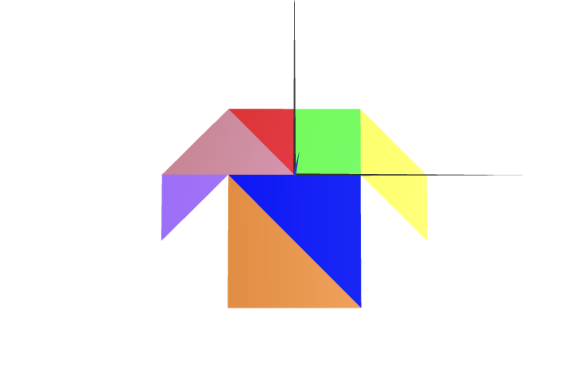
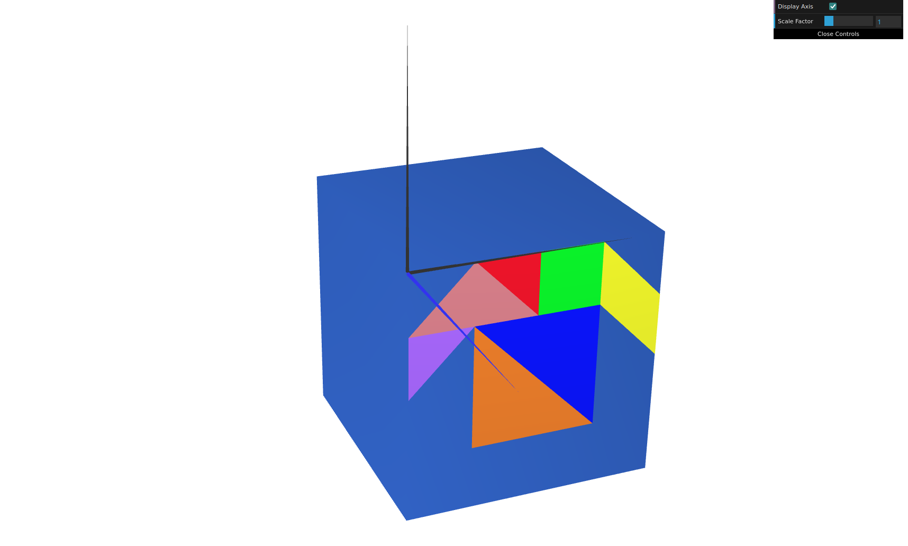
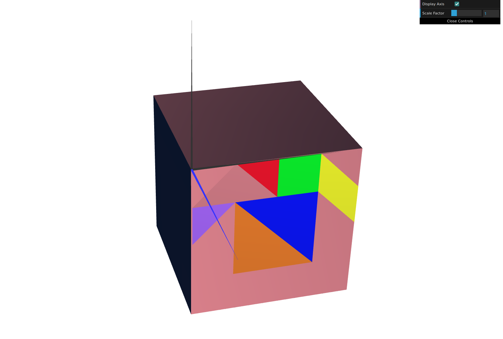

# CG 2025/2026

## Group T12G05

## TP 2 Notes

- In exercise 1 we observed that different results occurred depending on whether we rotated or translated first.
- In exercise 1 we had difficulties understanding how to use translate to position the pieces correctly.
- In exercise 1 we understood that the order of translate and rotate changes the outcome. Since matrix transformations are applied in reverse order, we decided to write translate before rotate in the code, so that the object is first rotated around its own origin and then moved to its final position.

- In exercise 2 we observed that the order of the vertices determined whether a face was visible or not, depending on which side it was viewed from.
- In exercise 2 we had difficulties visualizing the vertices, so we organized them consistently by always looking at each face from the outside and splitting it into two triangles along the top-left to bottom-right diagonal.

