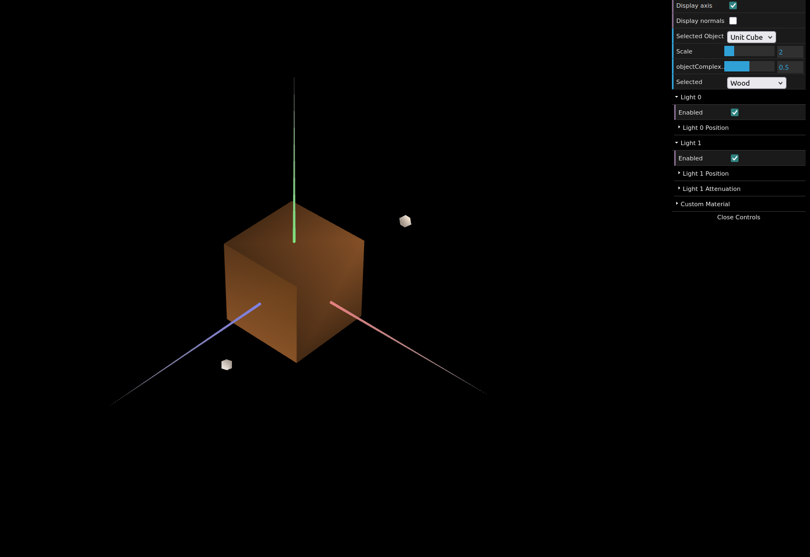
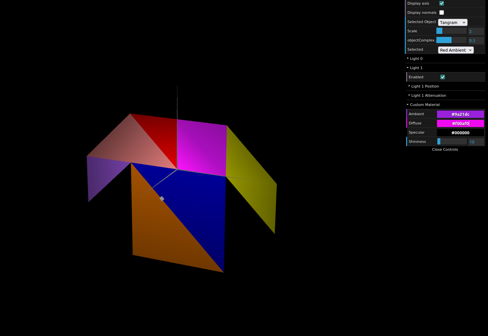
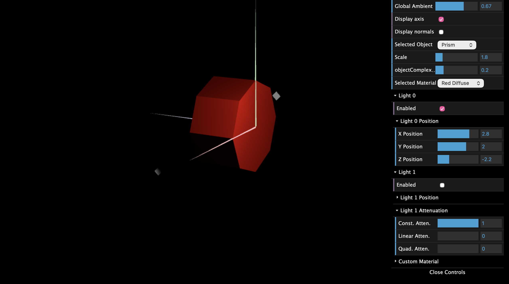
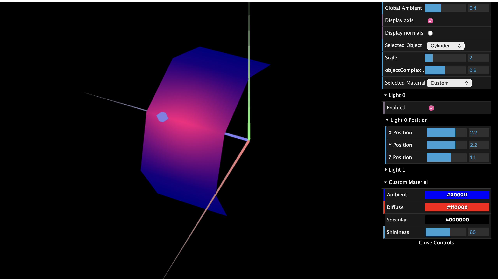

# CG 2025/2026

## Group T12G05

## TP 3 Notes

- In exercise 1 we added normals to the tangram pieces and the unit cube. Without normals the lighting didn't work at all, the objects just showed a flat color.
- We created a wood material with low specular and gave each tangram piece its own material with high specular. We could see the shininess value made the reflection smaller or bigger.
- The custom material was applied to the diamond piece so it can be changed in the interface.

- In exercise 2 we built the prism. We noticed that with flat normals per face the lighting looks the same across each face and changes abruptly at the edges, which is basically constant shading.
- Adding stacks made the specular reflection look better when zoomed in.

- In exercise 3 we made the cylinder by changing the normals to point outward from the center at each vertex angle. Vertices on the edge between two faces share the same normal so the lighting blends smoothly.
- We could see the difference between prism and cylinder - the prism has hard edges in the lighting and the cylinder looks more rounded even though the geometry is the same.

