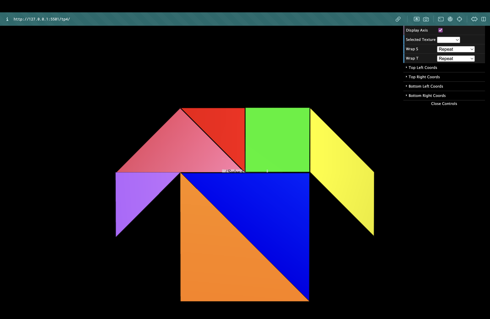
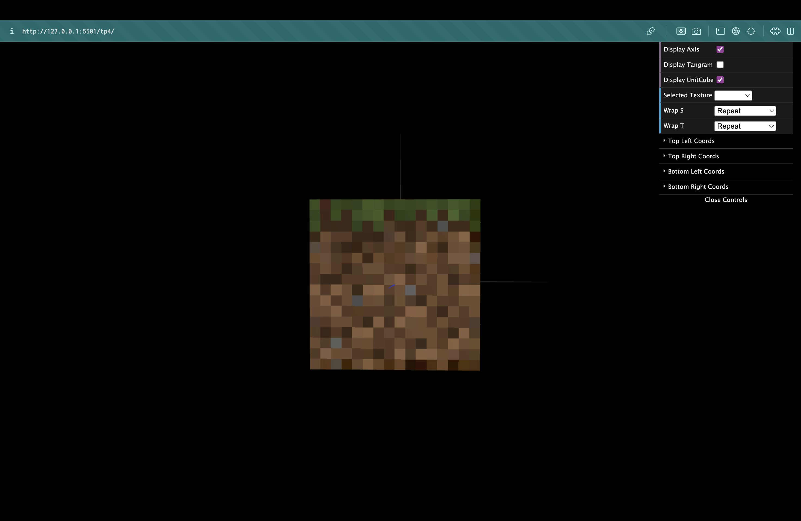

# CG 2025/2026

## Group T12G05

## TP 4 Notes

- In the first exercises, we learned how to map a 2D texture (`tangram.png`) onto our 3D Tangram objects. We created a new material with this texture inside `MyTangram`.
- To map the textures correctly, we analyzed the image to find the S and T axes coordinates (between 0.0 and 1.0) for each shape, and added them to a `this.texCoords` array in the `initBuffers()` function of `MyDiamond` and the remaining Tangram pieces.

- Then, we brought back `MyUnitCubeQuad` and adapted its constructor to receive 6 optional textures (top, front, right, back, left, bottom). 
- We applied the Minecraft block textures (`mineTop.png`, `mineSide.png`, `mineBottom.png`) and noticed that the 16x16 pixel images looked very blurry at first. This happens because WebGL defaults to a linear interpolation of colors (linear filtering) when a small texture covers a large area.
- To fix this and get the intended retro/pixelated visual, we applied `NEAREST` filtering using `this.scene.gl.texParameteri(this.scene.gl.TEXTURE_2D, this.scene.gl.TEXTURE_MAG_FILTER, this.scene.gl.NEAREST)` immediately after binding each texture and before drawing the respective face.

